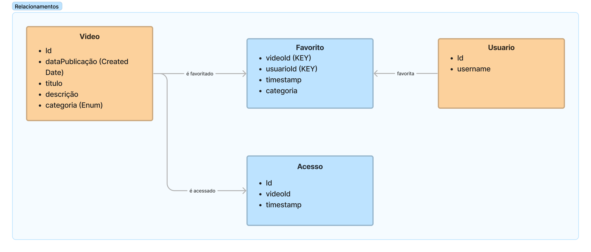
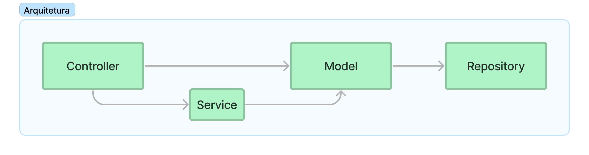

# Hubens: Plataforma de Vídeos

Hubens é uma plataforma de vídeos online, permitindo o streaming e a recomendação baseado em favoritos. Utiliza Spring Boot, Webflux e Mongo DB para possibilitar o uso de programação reativa.

## Objetivos

O principal objetivo deste relatório é discursar sobre o desenvolvimento e implementação do projeto.

Como objetivos específicos:

- Apresentar a estrutura e arquitetura;

- Discutir sobre escolhas realizadas e desafios encontrados.

## Desenvolvimento

### Tecnologias e Ferramentas

Para desenvolvimento do projeto foi utilizado Java e o paradigma de programação reativa. Desaa forma, nossa stack é composta por Java 17, *Spring Boot* 3, *Webflux* e Maven. Para persistência de dados foi escolhido o banco de dados Mongo DB, associado ao seu driver para permitir operações reativas, permitindo o uso do *Repository Pattern* em nosso código. Também foi utilizo o Docker para uso de instâncias conteinerizadas do banco de dados tanto no fluxo principal quanto no de testes.

Para testes estamos utilizando o JUnit 5, que vem configurado por padrão no projeto Spring. De forma a permitir a realização de testes de integração, foi configurada a ferramenta **Testcontainers**, que permite a instanciação e decomissionamento de instâncias do banco de dados diretamente pelo fluxo de testes, sendo estas gerenciadas pela própria aplicação.

Por fim, também foram utilizadas as seguintes ferramentas:

- Git e Github para versionamento e gerenciamento do projeto;

- *Postman*, para testes e documentação da API.

### Aplicação

Nesta fase foi realizada uma análise dos requisitos funcionais da aplicação Hubens. Assim foram identificados duas entidades principais do domínio: Vídeo e Usuário. Os vídeos correspondem ao núcleo do negócio, enquanto os usuários são os alvos.

Além das duas supracitadas, também foi definido um outro par de entidades que correspondem a fluxos comuns da aplicação: Acesso e Favorito. Sempre que um vídeo é reproduzido, um registro será criado para prover estatísticas de uso. Enquanto os favoritos são uma funcionalidade na qual o usuário pode indicar os vídeos que mais gostou, essas informações podem ser então utilizadas para gerar estatísticas de recomendação de conteúdo.

A imagem abaixo mostra os relacionamentos entre as quatro entidades e as propriedades que cada uma delas deve contér. 

Figura 1: Relacionamentos

Fonte: Produção do autor, 2024.

 

Embora o banco de dados Mongo DB seja não relacional, foi possível definir o campo ID do documento Favorito como a composição dos IDs dos documentos Vídeo e Usuário. Dessa forma, temos uma forma eficiente de busca e ainda conseguimos utilizar as chaves de maneira individual. Também por ser não relacional, o layout de dados não se encontra normalizado, havendo a duplicação do campo categoria. Isto permite a obtenção desta informação diretamente ao se realizar buscas nos documentos Favoritos, o que será de valia para simplificar a recomendação de conteúdo.

Note que no momento a funcionalidade de Acesso não está prevista para armazenar o id do usuário. Isto se deve ao fato, de apesar de comum, tal dado não ser necessitado nos fluxos de recomendação ou estatísitca. No entanto, uma alteração pode ser definida posteriormente e então adotado um *layout* similar ao dos Favoritos. 

Continuando a análise dos requisitos funcionais, podemos definir os seguintes fluxos como os principais casos de uso da aplicação:

- gerenciar vídeos (CRUD);
- gerenciar usuários (CRUD);
- Reproduzir vídeo;
- Favoritar vídeo;
- Recomendar vídeos;
- Visualizar estatíticas de videos.

Todos os casos de uso listados acima correspondem à ações que podem ser solicitadas ou engatilhadas a partir de solicitações da API *Web* da plataforma, desta forma foram definidos controladores específicas no nível de arquitetura de *software* para cada um dos casos listados acima.

### Arquitetura

Para este projeto foi escolhida uma arquitetura primariamente composta por *Controller*, *Model* e *Repository*. As camadas da controladora e repositório fazem o interfaceamento com elementos externos, servindo como adaptadores web e de persistência, respectivamente. A camada de Modelo contém nossas entidades do negócio, conforme já discutido na seção sobre a Aplicação.

Neste modelo, optamos por implementar as lógicas dos casos de uso diretamente na camada da controladora (na maioria das vezes), por dois motivos:

- um mapeamento bem próximo de um para um entre os casos de uso e os endpoints da API Rest;

- código curto da regra de negócio que em combinação coms os encadeamentos do processamento reativo dos sinais, muitas vezes se resolvia em apenas uma declaração de retorno.

No entanto, os algumas funcionalidades relacionada à Video e Recomendador possuem um código não tão direto, o que rendeu à estes dois componentes uma camada adicional de serviço.

Figura 2: Arquitetura

Fonte: Produção do autor, 2024.

 

## Discussões

Nesta seção, iremos abordar alguns pontos de destaque no desenvolvimento desta primeira fase:

- Programação Reativa e Webflux
- Persistência de dados
- Persistência e Streaming de vídeo
- Testes Integrados
- Recomendador

### Programação Reativa e Webflux

A programação reativa se apresentou como uma barreira em alguns pontos do desenvolvimento. Por vezes, foram definidos fluxos reativos dentro de blocos funcionais em `map`s ou `flatMap`s, porém não eram retornados e assim não executavam. Um desses casos foi o fluxo relativo ao método POST em `VideoController`, o primeiro passo é verificar assincronamente se o arquivo foi encaminhado na requisição e realizar as validações, em seguida proceder com a persistencia das informações em banco de dados e por fim na utilização do ID gerado no banco para a persistência do arquivo no sistema de armazenamento de arquivos. No entanto, por diversas vezes aconteceu desses 3 passos não estarem sendo executados propriamente.

Outras barreiras encontradas foram relativas ao grande número de adaptadores disponíveis para processar os sinais `Mono` e `Flux` e a ordenação do código em maneiras não bloqueantes, por vezes havia a tentação de apenas colocar um `block()` e obter o valor final.

### Persistência de dados

Para persistência das informações foi utilizado o banco de dados Mongo DB. O Mongo foi escolhido devido à possuir um driver que habilita a utilização de chamadas e também pela modelagm de nosso domínio de negócio não ser fortemente dependente em relacionamentos para retorno de dados pela união de tabelas. Temos um relacionamento estabelecido entre os documentos Video, Usuario e Favoritos, mas as consultas são realizadas considerando os documentos individualmente.

Além disso, o uso da MongoDB Query Language, que permite a utilização de JSON e de uma estrutura próxima da do documento para criar as queries nos repositórios se mostrou bastante simples e eficiente.

### Persistência e Streaming de vídeo

O *upload* do arquivo de vídeo é feito através de uma requisição POST multipart no Video Controller. Isso permite que o arquivo seja enviado em conjunto com seus dados e o armazenamento de ambos seja tratado de forma apropriada.

Por sua vez, a visualização do vídeo foi mapeada como um caso de uso diferente e assim uma nova controller criada para tratamento. No momento que o usuário utiliza o link do vídeo, o endpoint `/video_stream/{id}` é acessado, gerando um registro de visualização e disponibilizando o arquivo de vídeo por um *byte stream* de forma reativa, utilizando o módulo `DataBufferUtils` do *Spring*.

### Testes Integrados

Para os testes estamos utilizando a suíte JUnit 5 (já disponível no Spring), a tecnologia Testcontainers que permite a utilização de containeres descatáveis com instâncias do banco de dados e o plugin *JaCoCo* para geração de relatórios de cobertura de testes.

Infelizmente não foi possível utilizar a anotação `@TestInstance(TestInstance.Lifecycle.PER_CLASS)` em conjunto com o Testcontainers, o que levou à necessidade de inserção e remoção dos dados nas instâncias do banco de dados a cada teste. Uma opção a ser analisada posteriormente é o precarregamento desses dados juntamente com formas de manutenção dos mesmo como o mapeamento de volumes de arquivos e diretórios no sistema *host*.

### Recomendador

Foi criado um recomendador de conteúdo simples baseado nos vídeos favoritados pelo usuário. Uma busca limitada por período de tempo é efetuada para identificar as categorias mais favoritadas pelo usuário. Em seguida uma segunda busca é realizada para encontrar os vídeos `ids` dessas categorias que estejam em ascensão (alta volume de marcações de favoritos na última hora). Por fim, a partir dos `ìds` identificados são buscadas as informações dos vídeos para disponibilização para o usuário.

Outras abordagens seriam possíveis para a criação desta funcionalidade, por exemplo um sistema de recomendação baseado em filtragem colaborativa ou o uso de aprendizagem de máquina. O primeiro se baseia em encontrar usuários com gostos semelhantes e recomendar os conteúdos marcados como favoritos por eles, porém seria interessante ter uma amostra significativa de dados para ver o algoritmo em funcionamento. A outra opção seria treinar um modelo de aprendizagem de máquina utilizando por exemplo o *Apache Manhout*, mas tal se encontra fora de escopo.

## Considerações Finais

Neste projeto foi possível trabalhar com várias tecnologias interessantes como o *framework* Webflux, o banco de dados noSQL MongoDB e a ferramenta Testcontaines para testes de integração. O uso de tais ferramentas também trouxe seus desafios. A programação reativa do Webflux é um framework e um paradigma à parte que demandou adaptação. Por outro lado a criação de queries personalizadas nos repositórios com Mongo se mostraram bastante simples.
A ferramenta Testcontainers funcionou e possibilitou a realização dos testes sem a necessidade de dublês e com instâncias de banco de dados reais, no entanto suas anotações aprezentaram conflitos com algumas funcionalidades da suíte JUnit, o que limitou algumas possibilidades .

